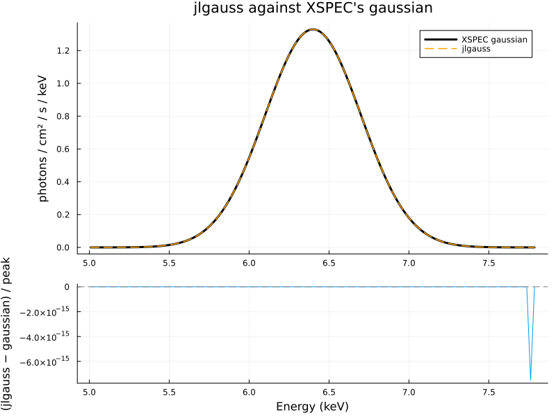
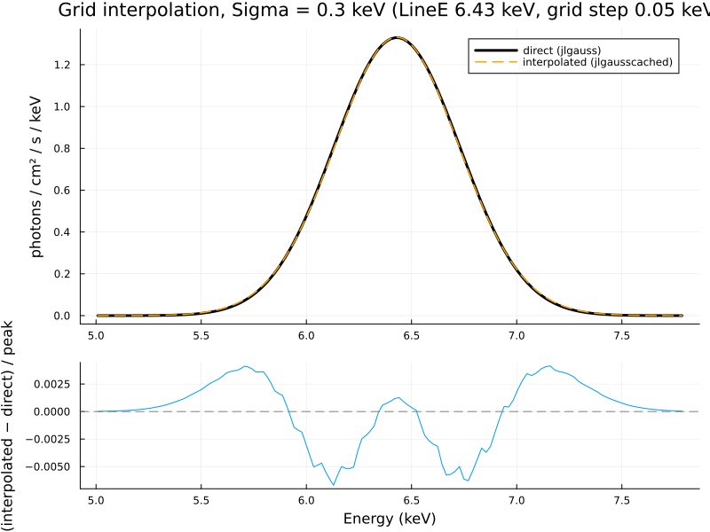
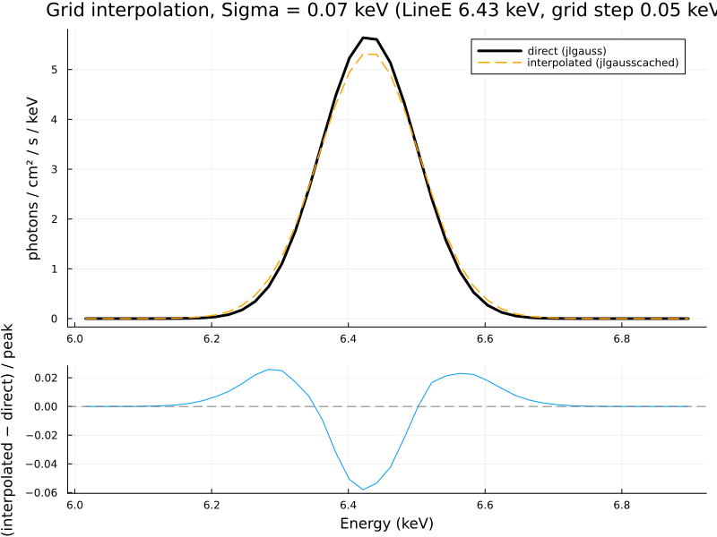
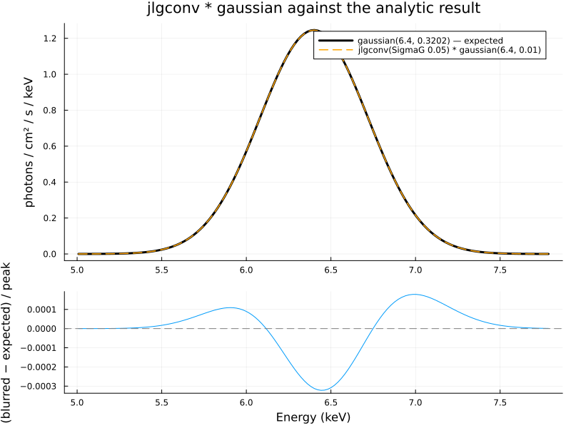
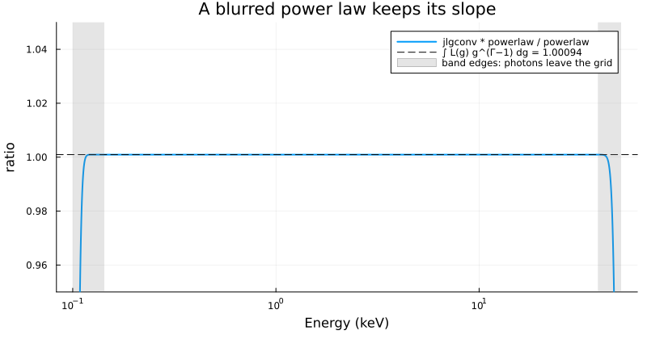

# Verification

Unit tests check each piece of JuliaXSPEC in isolation (`test/runtests.jl`,
run with `julia --project=. -e 'using Pkg; Pkg.test()'`). The comparisons on
this page go further: they run the compiled models *inside XSPEC* and compare
them with XSPEC's own models, so they exercise the C bridge, the generated
`model.dat`, XSPEC's parameter handling and the Julia code together.

## Running the comparisons

From the `verification/` directory, after both build steps:

```sh
xspec - phase1.xcm                 # evaluates model pairs, writes output/*.dat
julia --project=. -e 'using Pkg; Pkg.develop(path = ".."); Pkg.instantiate()'   # first time only
julia --project=. compare.jl       # prints the summary below and writes the figures
```

`phase1.xcm` defines a small Tcl procedure that evaluates the current model on
a 2000-bin logarithmic grid from 0.1 to 50 keV (`dummyrsp`) and writes the
model density (what `plot model` shows) to a text file. `compare.jl` reads
the pairs, reports the largest difference as a fraction of the reference
model's peak, and fails if any tolerance is exceeded.

## Results

```text
jlgauss vs XSPEC gaussian (LineE 6.4, Sigma 0.3)              max |Δ| / peak =  1.27e-08   tolerance 1.0e-06   ok
jlgausscached vs jlgauss (LineE 6.43, Sigma 0.3)              max |Δ| / peak =  6.69e-03   tolerance 2.0e-02   ok
jlgausscached vs jlgauss (LineE 6.43, Sigma 0.07)             max |Δ| / peak =  5.80e-02   tolerance 5.0e-01   ok
jlgconv(0.05) * gaussian(6.4, 0.01) vs gaussian(6.4, 0.3202)  max |Δ| / peak =  3.22e-04   tolerance 5.0e-03   ok
jlgconv(0.05) * powerlaw(2.5) vs 1.00094 * powerlaw(2.5)      max |Δ| / peak =  3.02e-06   tolerance 2.0e-03   ok
```

### 1. Direct evaluation: `jlgauss` against `gaussian`

Both integrate the same Gaussian over the same bins, so they should agree to
rounding. They do: the largest difference is ``10^{-8}`` of the peak. This
confirms that parameters arrive in the right order, that the result is
interpreted as photons per bin, and that nothing is lost in the C bridge.



### 2. Grid interpolation: `jlgausscached` against `jlgauss`

`jlgausscached` computes the Gaussian only at grid corners (`LineE` every
0.05 keV, `Sigma` logarithmically spaced) and interpolates. At
`LineE = 6.43` keV, between grid points, a 0.3 keV wide line is reproduced to
0.7% of the peak:



A 0.07 keV wide line, comparable to the grid step, shows the characteristic
signature of multilinear interpolation: the blend of the two neighbouring
corners is lower at the peak and higher in the wings than the true line,
here by 6% of the peak:



This is not a bug but the behaviour to design around: the grid spacing must be
small compared to the width of the features (see
[Caching on a grid](caching.md)). The tolerances in `compare.jl` are set
accordingly — tight for the broad line, loose for the narrow one, whose purpose
is to show the effect.

### 3. Convolution of a narrow line: `jlgconv * gaussian`

A Gaussian kernel in ``g`` with ``\sigma_g = 0.05`` applied to a line at
6.4 keV with ``\sigma = 0.01`` keV must give a Gaussian of width
``\sqrt{(0.05 \times 6.4)^2 + 0.01^2} = 0.3202`` keV
([Convolution](convolution.md), step 10). XSPEC's `gaussian` with that width
agrees to ``3 \times 10^{-4}`` of the peak; the residual has the shape of a
tiny width difference, from the uniform-within-bin approximation applied to
the 0.01 keV input line on 0.003 keV bins.



### 4. Convolution of a power law: `jlgconv * powerlaw`

A kernel in ``g`` cannot change the slope of a power law, only its
normalisation, by ``\int L(g)\,g^{\Gamma - 1}\,dg`` (1.00094 for
``\Gamma = 2.5`` and this kernel). The ratio of the blurred to the unblurred
power law is flat at that value across the grid, to ``3 \times 10^{-6}``,
except within a factor ``g_{\max} = 1.3`` of the top and ``g_{\min} = 0.7`` of
the bottom of the grid, where photons are shifted off the grid — exactly the
band-edge effect described in step 7 of the Convolution page, and the reason
to use XSPEC's `energies extend` with any convolution model.



## Planned comparisons

Later phases will add, with the same machinery: `jltable` against
`atable{xillverD-5.fits}`; FFT against direct convolution; and relativistic
blurring kernels against relxill's `relconv`, `relconv_lp` and `relxilllp`.
